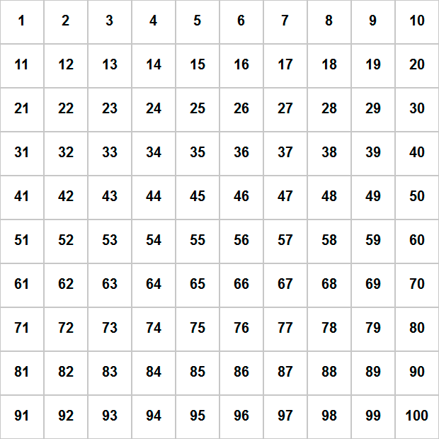

Parallaxator
=======
Parallaxator is a jQuery-based parallax plugin. It's simple, and amazingly easy to use.
[You can see a demo here](http://opensource.qodio.com/parallaxator).


Usage
-----
###### include in head:
```html
<link rel="stylesheet" href="fm.parallaxator.jquery.css">
<script src="jquery-1.11.3.min.js"></script>
<script src="fm.parallaxator.jquery.js"></script>
```

###### example on usage:
```html
<div class="parallaxator">
	
	<h1 class="parallax_child" data-parallaxator-reverse="true" data-parallaxator-velocity="0.45">
		A text
	</h1>
</div>
```
